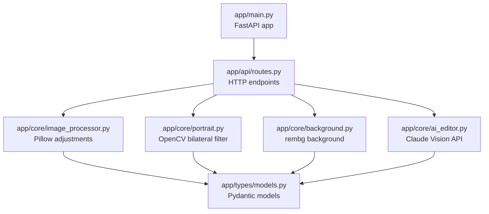

# 架构文档

## 层级依赖图



## 层级约束

| 层 | 包 | 允许导入 |
|----|-----|---------|
| 0 – Types | `app/types/` | 标准库 + 第三方（pydantic）|
| 1 – Core | `app/core/` | types/ + 标准库 + 第三方 |
| 2 – API | `app/api/` | core/ + types/ + 标准库 + 第三方 |
| 3 – Entry | `app/main.py` | api/ + 标准库 + 第三方 |

**违禁**：core/ 不得导入 api/；types/ 不得导入任何 app 内部模块。

## 请求生命周期

```
浏览器 ──POST /api/upload──► routes.upload_image()
                              └─ 写 uploads/{uuid}.jpg
                              └─ 返回 {filename, width, height}

浏览器 ──POST /api/edit/manual──► routes.manual_edit()
                                   ├─ image_processor.apply_basic_edits()
                                   ├─ portrait.apply_portrait()
                                   ├─ background.apply_background()
                                   └─ 写 outputs/edited_{hex}.jpg

浏览器 ──POST /api/edit/ai──► routes.ai_edit()
                               ├─ ai_editor.analyze_and_plan()  → Claude API
                               │     返回 EditParams + PortraitParams + BackgroundParams
                               ├─ image_processor / portrait / background（同上）
                               └─ 写 outputs/ai_{hex}.jpg
```

## 关键第三方依赖

| 库 | 用途 | 替代方案 |
|----|------|---------|
| Pillow | 基础图像操作 | 无 |
| OpenCV (`opencv-python-headless`) | 双边滤波磨皮 | 无 |
| anthropic | Claude Vision API | 无 |
| rembg | AI 背景去除 | 可选，降级为模糊 |
| FastAPI + uvicorn | Web 框架 | 无 |
| pydantic | 数据验证 | FastAPI 内置 |

## 文件存储策略

```
uploads/   只读区 — 原始上传，UUID 命名，不可覆盖
outputs/   输出区 — 处理结果，hex 命名，不可覆盖
app/static/ 静态资源 — 前端 HTML/CSS/JS
```

两个运行时目录在 `app/main.py` 启动时自动创建，并在 `.gitignore` 中排除。
